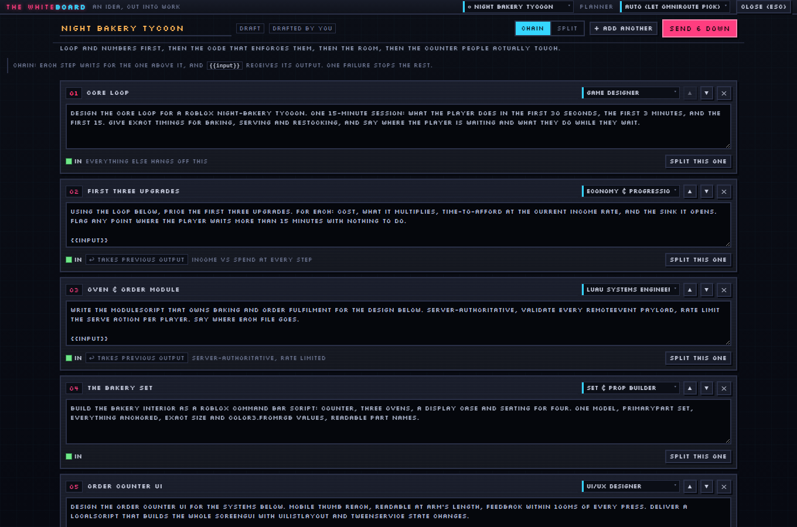

<div align="center">

# NIGHTSHIFT

**A pixel office where cheap models work the night shift and you are the boss.**


[](https://github.com/kaanisthatyou/nightshift/actions/workflows/ci.yml)
[](https://www.npmjs.com/package/@kaandrick/nightshift)
[](LICENSE)
[](https://nodejs.org)

</div>

Every desk on the floor is an agent backed by a real model served through an
[OmniRoute](https://www.npmjs.com/package/omniroute) gateway. Give an order and the boss
avatar physically walks to that desk, says the prompt in a speech bubble, and the worker
starts typing. **The monitor scrolls at the speed of the token stream** — what you are
watching is the actual response coming in. Finished work flies into the IN tray and waits
for you to approve it or throw it back.

It is a real tool wearing a costume: a local model gateway, a job queue, batching,
pipelines, an A/B arena, crew loadouts with real personas, and a whiteboard that cuts an
idea into work — with a window you can leave open on a second monitor and actually enjoy
looking at.

Claude Code drives the same floor over HTTP, so the heavy thinking happens in Claude while
the small, boring, repetitive work gets pushed down to free models.

```
  ┌──────────────────────────────────────────────────────────────┐
  │  Claude Code (orchestrator)  ── POST /api/orders ──┐         │
  │  You (the window)            ── click a desk ──────┤         │
  └────────────────────────────────────────────────────┼─────────┘
                                                       ▼
                                        NIGHTSHIFT floor server :20200
                                                       │
                                          OpenAI-compatible /v1
                                                       ▼
                                             OmniRoute :20128
                                     290+ providers · 500+ models · 90+ free
```

---

## Requirements

| | |
|---|---|
| **Node** | 22.6 or newer. The server runs as TypeScript, straight from source. |
| **OS** | Linux, macOS, Windows. Nothing platform-specific, no launcher scripts. |
| **A gateway** | Optional to *start*, required to reach a model. Anything OpenAI-compatible at a `/v1` base URL works; [OmniRoute](https://www.npmjs.com/package/omniroute) is what it is built and tested against. |
| **Provider keys** | None needed to try it. A bare OmniRoute serves ~115 models with no credentials at all. |
| **Network at runtime** | None. The pixel font is embedded and every sprite is drawn in code, so the window renders with the cable unplugged. |

## Run it

```bash
npx @kaandrick/nightshift
```

That is the whole thing — it builds the window on first run, tells you whether it found a
gateway, serves on **http://localhost:20200** and opens it. `Ctrl+C` closes the floor.

> The npm name is scoped because the registry blocks the bare `nightshift` as too close to
> an unrelated package called `night-shift`. `npm i nightshift` will simply find nothing —
> the scope is the only published coordinate. The command it installs is still `nightshift`.

Or from source, which is what you want if you intend to change anything:

```bash
git clone https://github.com/kaanisthatyou/nightshift
cd nightshift
npm install
npm start
```

Either way the same flags apply:

```bash
npm start -- --port 8080          # somewhere else
npm start -- --no-open            # don't touch the browser
npm start -- --gateway http://box.local:20128/v1
```

Working on it instead of using it:

```bash
npm run dev          # floor :20200 + vite :5180 with HMR, open http://localhost:5180
```

### Keep it current

The floor asks npm on boot whether something newer exists and prints one line if so.
Nothing installs itself behind your back — updating is a command you type:

```bash
npx @kaandrick/nightshift@latest   # npx caches by name, @latest is how you get past it
nightshift --update                # installed it globally? this replaces it
nightshift --version               # what you are actually running
```

From a clone it is `git pull && npm install && npm run build`. The check is a single
request to the npm registry with a 2.5s leash — silence it with `--no-update-check` or
`NIGHTSHIFT_NO_UPDATE_CHECK=1`, and it stays quiet on its own when you are offline.

### Plug in a gateway

```bash
npm install -g omniroute
omniroute            # dashboard + gateway on http://localhost:20128
```

Then in NIGHTSHIFT open the **gateway** tab, paste `http://localhost:20128/v1` and — only if
your instance requires one — the API key from its dashboard → Endpoints. Hit connect and the
model board fills up.

Environment variables work too (see `.env.example`):

```bash
OMNIROUTE_URL=http://localhost:20128/v1 OMNIROUTE_KEY=sk-... npm start
```

Have a pile of provider keys to load into OmniRoute? `cp keys.example.txt ~/.omniroute/keys.txt`,
fill it in, then `npm run keys` (`npm run keys -- --dry-run` first if you want to see the
parse without sending anything). NIGHTSHIFT never stores a provider key itself — it only ever
talks to the gateway.

---

## The floor

 

| thing | what it means |
|---|---|
| desk | one agent, one model, one seat (8 desks max) |
| name / cyan label | who they are and which model is sitting there |
| monitor scroll speed | live token stream from that model |
| speech bubble | boss orders and worker replies, as they happen |
| morale bar | up when you approve, down when you reject or it fails |
| IN tray | finished work waiting for review |
| payroll | real cost, computed from the gateway's pricing |
| neon sign | pink = gateway up, red flicker = gateway down |

Click a desk to select it, `/` focuses the order bar, `Esc` closes a task or the whiteboard.
Three desks are already staffed on first boot so there is something to give an order to.

### Two rules the product will not break

**Unpriced is not free.** A gateway only reports pricing for providers it has credentials
for. Models it gives no price for are tagged **`no price`**, never `free` — unknown is not
the same as free. Only a known price, or a real per-response cost header, moves the payroll
figure.

**Nothing is invented behind your back.** Some catalog entries are listed but answer
`401 not supported`. When that happens the desk does not silently die and does not silently
swap either: the task is retried once on the gateway's own `auto` router and the result is
stamped **`fell back from <model>`** in the board and in the task detail, so you always know
who actually did the work.

And with no gateway reachable at all, the floor still runs — but every output is marked
`GHOST OUTPUT` and tagged `ghost` in the API. Nothing is sent anywhere and nothing is made
up. Turn it off in gateway → house rules.

## Loadouts — a crew, not eight copies of one model

A desk is not just a model with a name on it. Under **crew** you pick a **loadout** and the
crew walks in together: pick *Roblox Studio* and you get a game designer, a Luau systems
engineer, a set builder and a UI designer, each with a system prompt written for that job.
Behind them is a **bench** — `+ add another` gives you the asset & tool scout, the economy
balancer, the playtester, the live-ops desk. Hire, fire, hire someone else.

| loadout | who walks in |
|---|---|
| `roblox` | designer · luau · builder · ui — bench: tool scout, economy, vfx, playtester, live ops |
| `webapp` | product · frontend · backend · design — bench: copy, security, deploy, tests |
| `content` | research · script · titles · editor — bench: thumbnails, distribution |
| `research` | scout · summariser · skeptic · synthesist — bench: sourcing |
| `data` | extractor · classifier · cleaner — bench: schema, analyst |
| `localize` | translator · tone editor · glossary — bench: cultural adapter |
| `venture` | market · strategy · naming · pitch — bench: devil's advocate |
| `general` | generalist · writer · editor — bench: code hand, list machine |

Every desk also gets a **temper** — `perfectionist`, `speedrunner`, `contrarian`, `pedant`,
`showman`, `minimalist`, `paranoid`, `steady` — which is welded onto the role to make that
desk's actual system prompt. Two desks on the same role with different heads give you two
genuinely different answers, which is the point. Open **head** on any file card to read the
prompt, swap the temper, or write your own.

## The whiteboard — plan it before you work it



Some asks are bigger than one desk. Type the whole messy idea into the whiteboard, hit
**span it out**, and it comes back as steps: each with a title, a self-contained prompt, and
a role against it. Then the part that matters — you edit it. Rewrite a prompt, reorder,
untick what you do not want, pin a step to a specific desk, or **split this one** to break a
step into three. Nothing has run and nothing has cost anything yet.

When it looks right, **send it down** as one job:

- **chain** — each step waits for the one above it and `{{input}}` receives its output.
- **split** — every step goes out at once across free desks.

The plan then shows up in the **plan** tab with live progress while the floor works, so you
can watch it land desk by desk. `plan it` next to the order bar carries whatever you already
typed straight onto the board.

Planning runs on its own model (**mains ▸ planner**) — worth a smarter one than the desks,
since every step inherits its judgement. That call lands on the same payroll as everything
else; nothing is spent quietly.

## The router — eight desks under one rate limit

Eight desks working at once is eight requests a minute into the same provider, and a free
tier like NVIDIA NIM's 40 RPM notices. Two things keep the floor under it.

**A combo does the spreading.** OmniRoute's combos are pools of models it routes across by a
strategy — `round-robin`, `least-used`, `headroom`, and sixteen others. The **mains ▸ the
router** panel lists the combos your gateway has, says which one is live, and switches it in
one click; every desk sitting on `auto` follows it. The picker also offers the virtual ones
straight up, under **routers**:

| | |
|---|---|
| `auto` | balanced — sticks to the last good provider |
| `auto/offline` | **most quota and rate-limit headroom first** — the one for a busy floor |
| `auto/cheap` · `auto/fast` · `auto/coding` · `auto/smart` | cheapest, lowest latency, code weights, quality + exploration |

**A rate limit is a clock, not a failure.** When a provider answers `429`, the desk does not
fail: it takes a coffee for exactly as long as `Retry-After` said, the task waits with it, and
nothing is marked failed, no retry is spent and no morale is lost. If the same task is told to
wait twice, it moves to the router — stamped `fell back from <model>`, like every other
reroute. Four waits in a row is a wall, not a busy minute, and it is reported as a failure.

So the honest way to run a free NIM tier flat out is: desks on `auto` (or `auto/offline`), a
`round-robin` or `headroom` combo live, and **at once** on 8.

## The toolbox — MCP servers on a desk

A desk can be given real tools. Point NIGHTSHIFT at an MCP server and its tools become
callable by whichever desks you hand them to: the model asks for a tool, the floor runs it,
the result goes back into the same conversation, and it repeats until the desk answers in
words or burns `mcpMaxRounds` (6 by default). Every call is recorded on the task — server,
tool, arguments, result, milliseconds — so you can see what a desk actually touched.

There is no panel for it yet; it lives on the API and in `data/mcp.json`:

```bash
# stdio, http and sse all work — or paste a whole mcpServers block from another client
curl -s localhost:20200/api/mcp -H 'content-type: application/json' \
  -d '{"name":"fs","transport":"stdio","command":"npx","args":["-y","@modelcontextprotocol/server-filesystem","."]}'

curl -s localhost:20200/api/mcp                       # who is up, and their tool lists
curl -s -X PATCH localhost:20200/api/workers/<id> -H 'content-type: application/json' \
  -d '{"mcpIds":["<serverId>"]}'                      # hand that server to one desk
```

Two things worth knowing. A desk only sees servers you gave it — nobody gets the whole
toolbox by default, because twenty-six schemas in front of a cheap model is how you get the
wrong tool called. And a stdio server is a child process of the floor: it starts when the
floor does and dies with it. Turn the whole thing off with `POST /api/settings
{"mcpEnabled":false}`.

## Batches, pipelines, arena

Three ways to move volume, all in the board tab and all on the API:

- **Batch** — one template, a list of items, split across whichever desks are free, with
  retries landing on a *different* desk than the one that failed.
- **Pipeline** — steps that feed each other. `{{input}}` is replaced with the previous
  step's output. Draft on a free model, polish on a better one, translate on a third.
- **Arena** — the same prompt to several desks at once, side by side, and you pick the
  winner. It is recorded on that desk. Stop guessing which free model is better.

## Claude Code as the boss

The whole floor is drivable over HTTP:

```bash
# give an order and wait for the answer (this is the one you want)
curl -s localhost:20200/api/orders -H 'content-type: application/json' \
  -d '{"text":"rewrite these 20 commit messages in imperative mood: ...","wait":true}'

# fire and forget, then read it back later
curl -s localhost:20200/api/orders -H 'content-type: application/json' -d '{"text":"...","wait":false}'
curl -s localhost:20200/api/tasks/<id>
```

A Claude Code skill ships in `nightshift-skill/` — the playbook for when to delegate, how to
fan work out across desks, how to run an arena, and how to report back honestly about which
model did what:

```bash
cp -r nightshift-skill ~/.claude/skills/nightshift        # macOS / Linux
```

```powershell
Copy-Item -Recurse nightshift-skill $HOME\.claude\skills\nightshift   # Windows
```

Then just say *"nightshift these"* and hand over a batch.

### API

| method | path | what it does |
|---|---|---|
| GET | `/api/state` | full snapshot: workers, tasks, jobs, ledger, gateway |
| GET | `/api/models?refresh=1` | model board with free/price flags |
| POST | `/api/gateway` | `{baseUrl, apiKey}` — reconnect |
| POST | `/api/settings` | `{autoAssign?, ghostMode?, maxParallel?, defaultModel?, plannerModel?, mcpEnabled?, mcpMaxRounds?}` |
| GET | `/api/combos` | the gateway's routing combos and which one is live |
| POST | `/api/combos/use` | `{name}` — switch the live combo |
| GET | `/api/presets` | the loadout catalog: crews, roles, tempers |
| POST | `/api/presets/:id/hire` | `{replace?, roleKeys?, model?, temper?}` — bring a crew in |
| POST | `/api/workers` | `{model?, presetId?, roleKey?, temper?, name?, persona?}` — hire one |
| PATCH | `/api/workers/:id` | `{model?, roleKey?, temper?, persona?, name?, state?, mcpIds?, mcpTools?}` — change the desk, the head, or its tools |
| DELETE | `/api/workers/:id` | fire |
| POST | `/api/orders` | `{text, workerId?, model?, wait?, waitMs?}` — the boss walks over |
| POST | `/api/tasks` | same but without the theatre defaults |
| GET | `/api/tasks/:id` | one task with output, tokens, cost, latency, routing decision |
| POST | `/api/tasks/:id/approve` | morale up, task closed |
| POST | `/api/tasks/:id/reject` | `{note}` — sends it back with your note attached |
| POST | `/api/tasks/:id/retry` | run it again |
| POST | `/api/plans` | `{idea, presetId?, stepCount?}` — span an idea out (or pass `steps` to write it yourself) |
| GET | `/api/plans/:id` | the plan and the tasks it was cut into |
| PATCH | `/api/plans/:id` | `{title?, mode?, steps?}` — edit the board |
| POST | `/api/plans/:id/expand` | `{stepId, count?}` — split one step into several |
| POST | `/api/plans/:id/run` | `{mode}` — `chain` or `split`, onto the floor |
| GET | `/api/mcp` | the toolbox: every server, its state and its tools |
| POST | `/api/mcp` | one server, or a whole `mcpServers` block pasted from another client |
| PATCH | `/api/mcp/:id` | `{enabled?, allow?, ...}` — edit and reconnect |
| DELETE | `/api/mcp/:id` | drop it, and take it off every desk |
| POST | `/api/mcp/:id/reconnect` | re-open and re-list its tools |
| POST | `/api/mcp/:id/call` | `{tool, args}` — call one yourself, to check it works |
| POST | `/api/jobs` | `{title, steps:[{title, prompt}]}` — pipeline |
| POST | `/api/batch` | `{title, template, items[], retries}` — one list split across desks |
| POST | `/api/arena` | `{text, workerIds?}` — same prompt to several desks |
| POST | `/api/arena/:id/winner` | `{taskId}` — your call, recorded on that desk |
| POST | `/api/office` | `{kind}` — make something happen (`pizza`, `gossip`, `cat`, `printer`, `flicker`, `sleepy`) |
| POST | `/api/boss/say` | `{text, workerId?}` — talk to the room |
| WS | `/ws` | every event, live |

---

## Layout

```
bin/nightshift.mjs  the one command: build check, gateway probe, serve, open
server/             floor server: gateway client, scheduler, REST, websocket
  omniroute.ts        streaming OpenAI-compatible client + model/pricing normalising
  engine.ts           who works on what, retries, pipelines, the theatre timing
  store.ts            state + json persistence (data/floor.json)
  routes.ts           the API above
  planner.ts          the whiteboard: idea -> steps -> one job
  mcp.ts              the toolbox: mcp servers over stdio/http/sse, and the tool loop
web/src/            the window
  pixel/art.ts        every object on the floor as a char grid, DOM-free on purpose
  pixel/sprites.ts    bakes art.ts to canvases, plus the people
  pixel/scene.ts      the 360x240 renderer: rain, lighting, walking, bubbles
  components/         crew, plan, board, wire, mains panels + the whiteboard
tools/              art review and key import
shared/             types both sides agree on
  presets.ts          the crew loadouts, roles and tempers
```

## Drawing the pixel art


`art.ts` holds no DOM calls, which lets the art be rendered and looked at without a browser.
Two tools do that:

```bash
npm run art          # every asset on a contact sheet + a room mock, into .art/
npm run shots        # the REAL FloorScene, headless, into docs/
```

`npm run art` fails loudly on the three things that go wrong when you draw with strings: a
row of the wrong length, a character with no palette entry, and an asset that nothing in
`scene.ts` ever draws. Both run in CI — the images in this README are generated by
`npm run shots`, not screenshotted by hand.

More in [CONTRIBUTING.md](CONTRIBUTING.md), including the desk geometry contract every prop
depends on.

## License

MIT — see [LICENSE](LICENSE).

One exception: the Silkscreen typeface is embedded as base64 so the floor works offline. It
is copyright The Silkscreen Project Authors under the SIL Open Font License 1.1 and is not
covered by the MIT license — details in [NOTICE.md](NOTICE.md).
